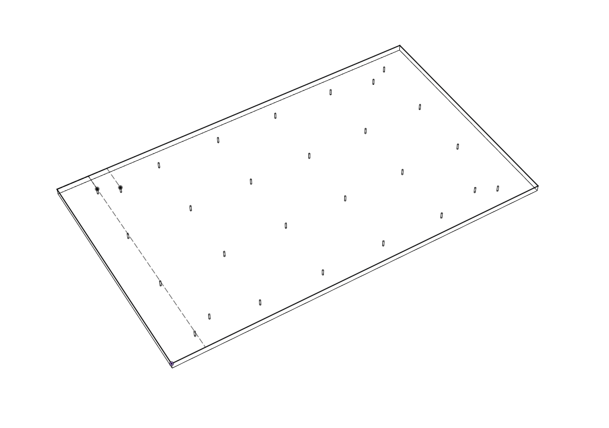

# Доработки

## Столик для резки

.png>)

Fusion 360 модель для сверловки столика:

В модели столик сделан толщиной 5мм только для того, чтобы накернить отверстия. Дальше работа шуруповертом/дрелью.
