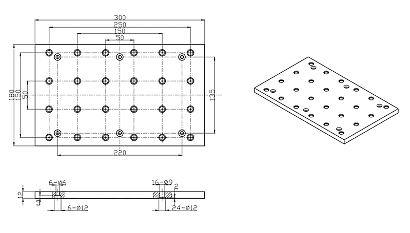

# Доработки

## Жертвенный столик

**Fusion 360 модель для сверловки столика:**

В модели столик сделан толщиной 5мм только для того, чтобы накернить отверстия. Дальше работа шуруповертом/дрелью.

[Скачать модель (.f3d)](https://github.com/Yadro/cnc3018/raw/master/.gitbook/assets/CNCTable.f3z)

